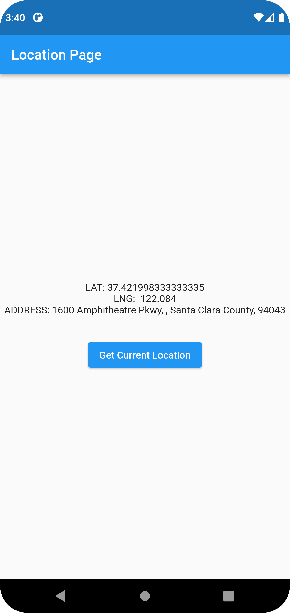

# Flutter Get Location
    Get current location with Flutter


## Output


## Setting for Android
- Add the required dependencies, the [geolocator](https://pub.dev/packages/geolocator) and [geocoding](https://pub.dev/packages/geocoding) packages to ```pubspec.yaml``` file.

```
$ flutter pub add geolocator
$ flutter pub add geocoding
```

- For android:
    - First, we need to add the following lines below to your ```gradle.properties``` file:
    ```
    android.useAndroidX=true
    android.enableJetifier=true
    ```
    - Next, make sure to set the ```compileSdkVersion``` in your ```android/app/build.gradle``` file to 31.
    - Then, we need to add either the ```ACCESS_FINE_LOCATION``` or the ```ACCESS_COARSE_LOCATION``` permission your ```android/app/src/main/AndroidManifest.xml``` file
    ```
    <uses-permission android:name="android.permission.ACCESS_FINE_LOCATION"/>
    ```

## Code
```dart
import 'package:flutter/material.dart';
import 'package:geocoding/geocoding.dart';
import 'package:geolocator/geolocator.dart';

void main() {
  runApp(const MyApp());
}

class MyApp extends StatelessWidget {
  const MyApp({Key? key}) : super(key: key);

  @override
  Widget build(BuildContext context) {
    return const MaterialApp(
      title: 'Flutter Location Demo',
      debugShowCheckedModeBanner: false,
      home: LocationPage(),
    );
  }
}

class LocationPage extends StatefulWidget {
  const LocationPage({Key? key}) : super(key: key);

  @override
  State<LocationPage> createState() => _LocationPageState();
}

class _LocationPageState extends State<LocationPage> {
  String? _currentAddress;
  Position? _currentPosition;

  Future<bool> _handleLocationPermission() async {
    bool serviceEnabled;
    LocationPermission permission;

    serviceEnabled = await Geolocator.isLocationServiceEnabled();
    if (!serviceEnabled) {
      ScaffoldMessenger.of(context).showSnackBar(const SnackBar(
          content: Text(
              'Location services are disabled. Please enable the services')));
      return false;
    }
    permission = await Geolocator.checkPermission();
    if (permission == LocationPermission.denied) {
      permission = await Geolocator.requestPermission();
      if (permission == LocationPermission.denied) {
        ScaffoldMessenger.of(context).showSnackBar(
            const SnackBar(content: Text('Location permissions are denied')));
        return false;
      }
    }

    if (permission == LocationPermission.deniedForever) {
      ScaffoldMessenger.of(context).showSnackBar(const SnackBar(
          content: Text(
              'Location permissions are permanently denied, we cannot request permissions.')));
      return false;
    }

    return true;
  }

  Future<void> _getCurrentPosition() async {
    final hasPermission = await _handleLocationPermission();

    if (!hasPermission) return;

    await Geolocator.getCurrentPosition(desiredAccuracy: LocationAccuracy.high)
        .then((Position position) {
      setState(() => _currentPosition = position);
      _getAddressFromLatLng(_currentPosition!);
    }).catchError((e) {
      debugPrint(e);
    });
  }

  Future<void> _getAddressFromLatLng(Position position) async {
    await placemarkFromCoordinates(
        _currentPosition!.latitude, _currentPosition!.longitude)
        .then((List<Placemark> placemarks) {
      Placemark place = placemarks[0];
      setState(() {
        _currentAddress =
        '${place.street}, ${place.subLocality}, ${place.subAdministrativeArea}, ${place.postalCode}';
      });
    }).catchError((e) {
      debugPrint(e);
    });
  }

  @override
  Widget build(BuildContext context) {
    return Scaffold(
      appBar: AppBar(title: const Text("Location Page")),
      body: SafeArea(
        child: Center(
          child: Column(
            mainAxisAlignment: MainAxisAlignment.center,
            children: [
              Text('LAT: ${_currentPosition?.latitude ?? ""}'),
              Text('LNG: ${_currentPosition?.longitude ?? ""}'),
              Text('ADDRESS: ${_currentAddress ?? ""}'),
              const SizedBox(height: 32),
              ElevatedButton(
                onPressed: _getCurrentPosition,
                child: const Text("Get Current Location"),
              )
            ],
          ),
        ),
      ),
    );
  }
}

```