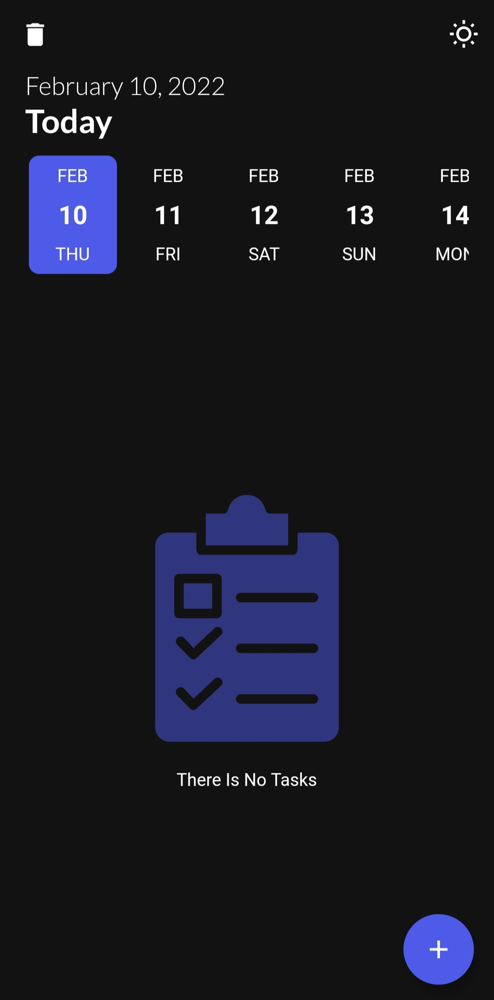
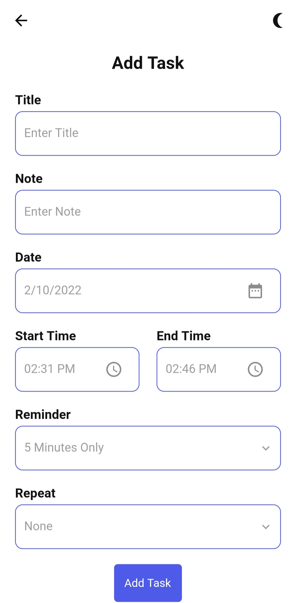

# Time Do

A TODO Flutter project.

## Getting Started

Setup: ```flutter pub get```

- Getx: ```flutter pub add get```
- Sqlite: ```flutter pub add sqlite```
- Notification: ```flutter pub add flutter_local_notifications```
- RxDart: ```flutter pub add rxdart```
- Other: ...

Flutter application

- Design Pattern : MVC
- Database(local) : SQFLite
- State Managament : GETX

Features :

- Dark Mode
- Local Notifications







- Code
    - Sqlite
  ```dart
  class DBHelper {
  static final _databaseName = 'todo.db';
  static final _tasks_table = 'tasks_table';
  static final _databaseVersion = 1;
  static Database? _database;

  Future<Database> get database async {
    if (_database != null) return _database!;
    // lazily instantiate the db the first time it is accessed
    _database = await _initDB();
    return _database!;
  }

  _initDB() async {
    String path = join(await getDatabasesPath(), _databaseName);

    return await openDatabase(path, version: _databaseVersion, onCreate: _onCreate);
  }

  _onCreate(Database db, int version) async {
    await db.execute('CREATE TABLE $_tasks_table('
        'id INTEGER PRIMARY KEY AUTOINCREMENT, title STRING, note TEXT, date STRING, startTime STRING, endTime STRING, remind INTEGER, repeat STRING, color INTEGER, isCompleted INTEGER'
        ')');
  }

  Future<int> insertTask(Task task) async {
    Database? db = DBHelper._database;

    return await db!.insert(_tasks_table, {
      'title': task.title,
      'note': task.note,
      'date': task.date,
      'startTime': task.startTime,
      'endTime': task.endTime,
      'remind': task.remind,
      'repeat': task.repeat,
      'color': task.color,
      'isCompleted': task.isCompleted,
    });
  }

  Future<List<Map<String, dynamic>>> queryAllRows() async {
    Database? db = DBHelper._database;
    return await db!.query(_tasks_table);
  }

  Future<int> delete(int id) async {
    Database? db = DBHelper._database;
    return await db!.delete(_tasks_table, where: 'id = ?', whereArgs: [id]);
  }

  Future<int> deleteAllTasks() async {
    Database? db = DBHelper._database;
    return await db!.delete(_tasks_table);
  }

  Future<int> update(int id) async {
    return await _database!.rawUpdate('''
    UPDATE $_tasks_table
    SET isCompleted = ?, color = ?
    WHERE id = ?
    ''', [1, 1, id]);
  }}
  ```